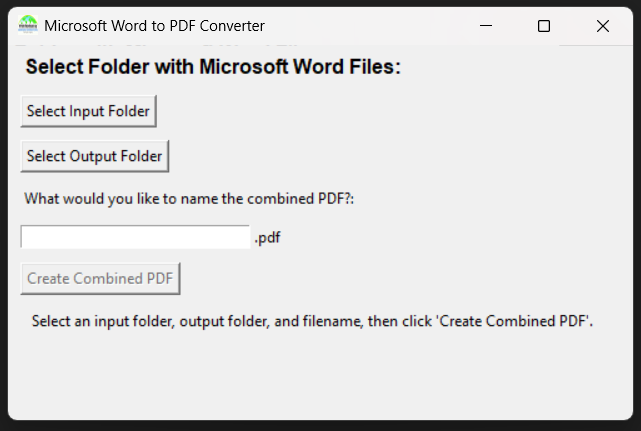
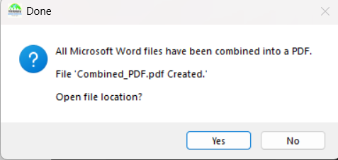

# Python Utils

A library of small, case-specific utilities using Python and Tkinter. Currently includes:
1) **MergePDF** - A Python CLI tool that converts and merges all .docx files in a directory into a single .pdf file.
2) **MergePDFGUI** - A Python tool with a GUI that converts and merges all .docx files in a directory into a single .pdf file.

_MergePDF and MergePDFGUI require Microsoft Word to be installed on the device_

## Features
- Merge multiple Word documents into a single PDF file
- Simple Drag-and-Drop interface
- Lightweight and Portable
- No advanced setup required

## Usage Instructions

### Download and Use Tools
To download and use any of these tools, go to the [latest release](https://github.com/tylerapear/python_utils/releases/tag/v1.0.6) and download either the .zip file or the .exe file for the tool that you want. 

#### How to use MergePDFGUI

1) Launch the app

Open the downloaded MergedPDFGUI application. You'll see the main interface:


---

2) Select Word documents

Click the "Select Input Folder" to select the folder where your Word files are present.
**Make sure your folder has only Word files!**


---

3) Choose output location

Select where you want the merged PDF to be saved.


---

4) Merge Files

Click **Merge** to generate the combined PDF. You'll see a confirmation message once it's complete.


### Install Source Code
To install the source code, follow these steps:

1) Ensure that you have Python 3.12.3 or later, pip, and optionally python3-venv installed on your device

    ```bash
    #Windows (Powershell using winget)
    winget install Python.Python.3
    ```
    ```bash
    #Mac (Using Homebrew)
    brew install python
    ```
    ```bash
    #Linux - Ubuntu/Debian
    sudo apt install python3 python3-pip python3-venv -y
    ```
    ```bash
    #Linux - Fedora
    sudo dnf install python3 python3-pip python3-virtualenv -y
    ```
    ```bash
    #Linux - Arch Linux
    sudo pacman -S python python-pip
    ```
    ```bash
    #Linux - CentOS / RHEL
    sudo yum install python3 python3-pip -y
    ```
  
2) Clone the repo to your local device:
   
    ```bash
    git clone https://github.com/tylerapear/python_utils.git
    ```
3) Optionally, create a virtual environment (venv) to install requirements:

    ```bash
    #Windows (Powershell)
    python3 -m venv venv   #create venv
    .\venv\Scripts\Activate.ps1   #switch to venv
    ```
    ```bash
    #Linux and Mac
    python3 -m venv venv   #create venv
    source venv/bin/activate   #switch to venv
    ```
    
4) Install requirements:

    ```bash
    pip install -r requirements.txt
    ```

Then, you're all set!

## Example Use Cases
- Combine reports into one PDF for submission.
- Merge multiple chapters into a single document.
- Prepare meeting notes or assignments into a single file.

## Contibuting
Contributions are welcome!
If you'd like to improve this project, please fork the repo and open a pull request.